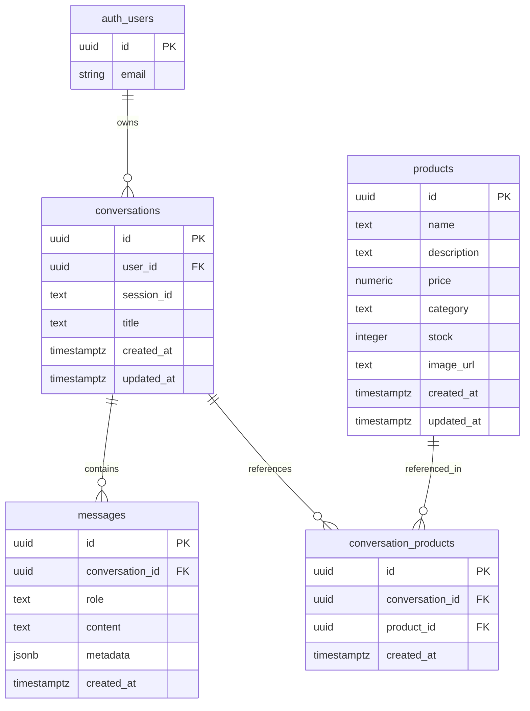

# Database Design

## ERD



## Relasi Tabel

- `auth.users.id` ke `conversations.user_id`.
- `conversations.id` ke `messages.conversation_id`.
- `conversations.id` ke `conversation_products.conversation_id`.
- `products.id` ke `conversation_products.product_id`.

`conversations.user_id` dibuat nullable agar public guest chat bisa disimpan dengan `session_id`. Untuk guest chat, gunakan Next.js API route dan Supabase service role di server, bukan direct insert dari anon client.

## Tabel

### `products`

Menyimpan data produk ecommerce.

- `id`
- `name`
- `description`
- `price`
- `category`
- `stock`
- `image_url`
- `created_at`
- `updated_at`

### `conversations`

Menyimpan sesi percakapan user.

- `id`
- `user_id`
- `session_id`
- `title`
- `created_at`
- `updated_at`

### `messages`

Menyimpan pesan user dan AI.

- `id`
- `conversation_id`
- `role`
- `content`
- `metadata`
- `created_at`

### `conversation_products`

Menyimpan relasi produk yang muncul atau direferensikan dalam percakapan.

- `id`
- `conversation_id`
- `product_id`
- `created_at`

## Index

- `products_category_idx` untuk filter kategori.
- `products_name_idx` untuk pencarian nama sederhana.
- `products_search_idx` untuk full-text search produk.
- `conversations_user_id_idx` untuk query conversation milik user login.
- `conversations_session_id_idx` untuk query conversation guest berdasarkan session.
- `conversations_updated_at_idx` untuk sorting rekap admin.
- `messages_conversation_id_created_at_idx` untuk mengambil urutan chat.
- `conversation_products_conversation_id_idx` untuk mengambil produk terkait percakapan.
- `conversation_products_product_id_idx` untuk melihat referensi per produk.

## RLS Policy

- Produk bisa dibaca publik.
- Produk hanya bisa dibuat, diubah, dan dihapus oleh admin.
- Conversation dan message user login hanya bisa dibaca/dibuat oleh owner.
- Admin bisa membaca dan mengelola semua conversation/message.
- Admin ditentukan dari JWT claim `app_metadata.role = admin`.

Untuk menjadikan user sebagai admin, set metadata user di Supabase Auth:

```json
{
  "role": "admin"
}
```

Migration lengkap tersedia di `supabase/migrations/001_initial_schema.sql`.
